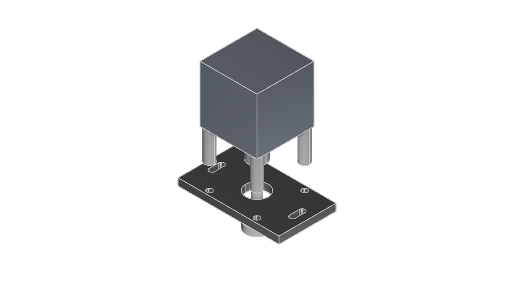

# ZooMounter Inspection Report

*Rendered from the generated KCL by `zoo kcl snapshot` -- this is the actual part, not an illustration of it.*

## Request
- Mount: NEMA 23 stepper motor mount with 608 on a stub shaft (with 2020-slots)
- Material: Aluminum 6061-T6
- Shaft load: 200.0 N radial
- Bracket load: 0 N (not a shaft load; not modelled)
- Safety factor: 2.0

## Shaft load: **BEARING REQUIRED**

A radial rating is a moment limit quoted at a distance from the mounting flange, so both sides are converted to a moment before being compared. Comparing the bare forces would be wrong in both directions.

| | Force | Distance | Moment |
|---|---|---|---|
| Applied | 200 N | 15 mm | 3000 N·mm |
| Published limit | 75 N | 20 mm | 1500 N·mm |

**Utilisation: 200%** of the published limit.

- **[LOUD WARN]** Radial shaft load 200N at 15mm (3000N.mm) exceeds the published limit 75N at 20mm (1500N.mm) for NEMA 23 stepper motor mount with 608 on a stub shaft (2.0x over). No bracket thickness fixes this -- the limit is the motor's own bearings, not the plate.
  - *Source*: ATO NEMA 23 (56mm) datasheet: Axial Max. Load 15N, Radial Max. Load 75N, corroborated by the 57HS-series datasheet ('Max. axial force 15N', 'Max. radial force 75N (20mm from the flange)'), which also supplies the measurement distance. Contested: Same Sky NEMA23-AMT112S publishes 15 lb = 66.7N axial.
  - *Remedy*: Support the shaft in its own bearing and drive through a coupling, so the side load reacts into the frame rather than the motor's front bearing.
- Stub-shaft topology chosen because the 608 is 22mm across against a 38.1mm pilot boss, so a seat concentric with the boss recess would have no material gripping it.
- Stub-shaft topology: the 608 carries a 8mm stub shaft, and the motor stands off 30mm on spacers driving it through a flexible coupling. The motor supplies torque only -- no side load or thrust reaches its own bearings.

## Plate thickness

Thickness is a manufacturing answer, not a structural one. The two candidates
are floors -- what the process can produce, and what the bearing needs to seat
in -- and the larger wins. ZooMounter does not size this plate against a load,
because for every part in its scope the structural requirement lands below the
process floor; see `docs/mechanics.html` for why that layer was removed rather
than kept as a sanity check.

- Process minimum wall: 1.00 mm
- Bearing seat requirement: 7.00 mm
- **Required thickness: 7.00 mm** (set by: bearing seat (608 outer-ring width))

### Notes
- Thickness is set by the bearing: the 608 needs 7.00mm of plate to seat in, against a 1.00mm process floor.
- 608 (8x22x7mm) carries 1370N static, against 400N required (200N at SF 2).
- 608 bore matches the 8mm shaft.
- **[WARN]** Selected on basic static rating C0 only. No L10 fatigue life has been calculated -- that needs shaft speed and duty cycle, which this tool does not ask for.
  - *Source*: SKF catalogue (bearingsize.info)
  - *Remedy*: For anything running continuously, do an L10 calculation with your real speed and duty against C = 3450N.
- 7.00mm plate fully supports the 7mm wide 608 outer ring.

## Verification (generated part vs. the spec it was asked for)

Hole positions and bounding box are read directly out of the generated STEP
file (local parse, no API calls). Volume is measured by Zoo's File Format API.

| Check | Result | Detail |
|---|---|---|
| Hole positions | PASS | all 9 holes present and within 0.5mm of spec (worst: 0.000mm) |
| Bounding box | PASS | 100.00 x 56.40 x 7.00 mm vs specified 100.00 x 56.40 x 7.00 mm (worst axis: width, 0.0%) |
| Volume | PASS | 35100.4 mm3 measured vs 34998.8 mm3 from the requested geometry (0.3%) |

Tolerances: 0.5mm absolute on hole positions, 15% on bulk dimensions and volume.

### Hole-by-hole

| Expected (x, y) mm | Dia mm | Found at (x, y) mm | Position error mm |
|---|---|---|---|
| (23.57, 23.57) | 5.50 | (23.57, 23.57) | 0.000 |
| (23.57, -23.57) | 5.50 | (23.57, -23.57) | 0.000 |
| (-23.57, -23.57) | 5.50 | (-23.57, -23.57) | 0.000 |
| (-23.57, 23.57) | 5.50 | (-23.57, 23.57) | 0.000 |
| (0.00, 0.00) | 22.00 | (-0.00, -0.00) | 0.000 |
| (-40.00, -4.75) | 5.50 | (-40.00, -4.75) | 0.000 |
| (-40.00, 4.75) | 5.50 | (-40.00, 4.75) | 0.000 |
| (40.00, -4.75) | 5.50 | (40.00, -4.75) | 0.000 |
| (40.00, 4.75) | 5.50 | (40.00, 4.75) | 0.000 |

Mass of the generated part: **94.77 g**. This is reported as a property, not counted as a check -- it is the measured volume multiplied by the density you supplied, so it carries no information the volume check doesn't.

## What this report does NOT cover

These are declared limitations, not oversights. Each is recorded in `zoomounter/data/rules.toml` with its reasoning.

- **A mount that travels sees acceleration loads and cable-loom drag on every direction change, and neither is modelled.**
  - *Basis*: Inertial loading on a moving axis scales with mass and peak acceleration, neither of which ZooMounter is told; drag-chain reaction depends on loom stiffness and routing.
  - *What to do*: Add your peak acceleration load to the shaft load you pass in, and plan the cable path separately.
- **A motor's reaction torque is not modelled, though it is present whenever the motor runs and is reacted as shear in the bolt pattern at the bolt-circle radius.**
  - *Basis*: Newton's third law. A NEMA 23 at 1.9 N.m across a 47.14mm square pattern puts roughly 28N on each bolt, fully reversing on a bidirectional axis.
  - *What to do*: For a reversing axis, check the bolts for fatigue and use thread locker. ZooMounter sizes neither.
- **Fatigue is not modelled, and a reversing axis loads its bracket cyclically at a level a static check calls safe.**
  - *Basis*: Standard fatigue behaviour: endurance limits sit well below yield, and aluminium has no true endurance limit at all.
  - *What to do*: For a high-cycle reversing application, have the bracket reviewed properly. This tool performs no fatigue analysis.
- **Crash and hard-stop impact loads are not modelled, and they can exceed the nominal running load by an order of magnitude.**
  - *Basis*: Transient impact behaviour on machine axes; the peak depends on stiffness and closing speed, neither of which ZooMounter knows.
  - *What to do*: Add soft limits and physical stops. Do not treat the running load as the worst case.
- **Belt pretension is not modelled, and it loads the shaft at zero torque before any useful work is done.**
  - *Basis*: Belt drive practice: pretension is typically a substantial fraction of the rated working tension and is present continuously.
  - *What to do*: Add your pretension to the shaft load you pass in. It does not go away when the machine is idle.

## Result: PASS

*Verification proves the generated part matches the spec it was asked for. It
cannot prove the spec was right -- that is what the rule registry and its
provenance statuses are for. See `RULES.md`.*
