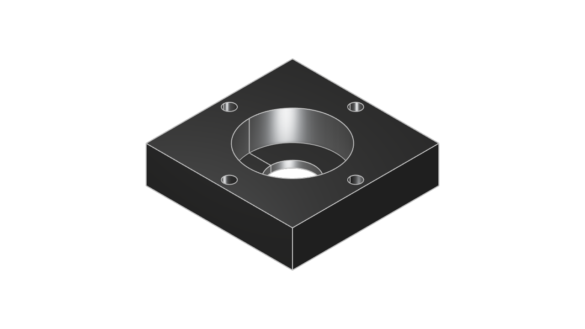

# ZooMounter Inspection Report

*Rendered from the generated KCL by `zoo kcl snapshot` -- this is the actual part, not an illustration of it.*

## Request
- Mount: 51101 thrust bearing block
- Material: Aluminum 6061-T6
- Load type: axial (Axial (thrust) load -- plate sized against screw-head pull-through (punching shear). For thrust, the plate is usually not the limiting element; see notes.)
- External load: 400.0 N
- Safety factor: 2.0

## Calculated requirement (domain rules layer, before generation)
- Lever arm: 0.00 mm
- Bending moment: 0.0 N*mm
- Allowable stress (yield / safety factor): 120.0 MPa
- Thickness from stress limit: 0.08 mm
- Thickness from deflection limit (arm/300, radial only): 0.00 mm
- Process minimum wall: 1.00 mm
- **Required thickness: 11.00 mm** (governed by: bearing seat (51101 counterbore + floor))

### Engineering notes
- Plate thickness is sized against screw-head pull-through (punching shear on a ~6.1mm head), which calls for 0.08mm here.
- 4x M3 class-8.8 screws carry an estimated 5835N in tension at SF 2.0, well above this load.
- **[WARN]** NOT CHECKED for axial loads: thread engagement depth in the motor's tapped holes, and the motor's own axial bearing rating.
  - *Remedy*: For thrust applications one of those is usually the real limit -- a thin result here means the plate is not your constraint, not that the assembly is safe.
- Axial load 400N is within the published axial limit of 16600N for 51101 thrust bearing block.
- Plate thickness is set by the bearing, not by the load: the 51101 needs 11.00mm of plate to seat in. The structural requirement here was 1.00mm.

## Verification (generated part vs. the spec it was asked for)

Hole positions and bounding box are read directly out of the generated STEP
file (local parse, no API calls). Volume is measured by Zoo's File Format API.

| Check | Result | Detail |
|---|---|---|
| Hole positions | PASS | all 6 holes present and within 0.5mm of spec (worst: 0.000mm) |
| Bounding box | PASS | 44.00 x 44.00 x 11.00 mm vs specified 44.00 x 44.00 x 11.00 mm (worst axis: width, 0.0%) |
| Volume | PASS | 15857.6 mm3 measured vs 15852.7 mm3 from the requested geometry (0.0%) |

Tolerances: 0.5mm absolute on hole positions, 15% on bulk dimensions and volume.

### Hole-by-hole

| Expected (x, y) mm | Dia mm | Found at (x, y) mm | Position error mm |
|---|---|---|---|
| (19.00, 0.00) | 3.40 | (19.00, -0.00) | 0.000 |
| (0.00, 19.00) | 3.40 | (-0.00, 19.00) | 0.000 |
| (-19.00, 0.00) | 3.40 | (-19.00, -0.00) | 0.000 |
| (-0.00, -19.00) | 3.40 | (-0.00, -19.00) | 0.000 |
| (0.00, 0.00) | 13.00 | (-0.00, -0.00) | 0.000 |
| (0.00, 0.00) | 26.00 | (-0.00, -0.00) | 0.000 |

Mass of the generated part: **42.82 g**. This is reported as a property, not counted as a check -- it is the measured volume multiplied by the density you supplied, so it carries no information the volume check doesn't.

## Result: PASS
